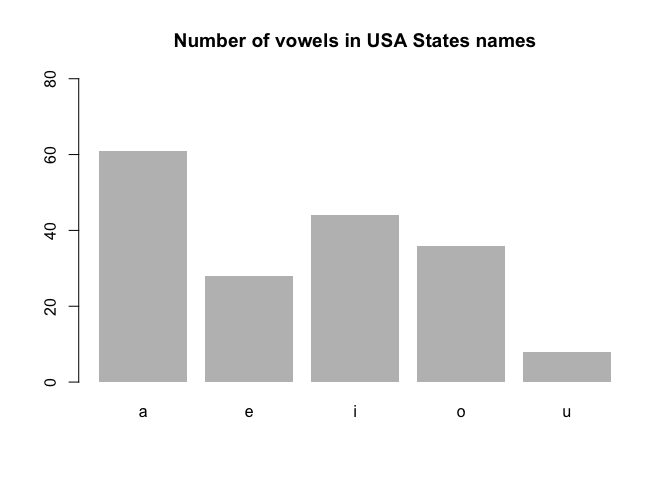
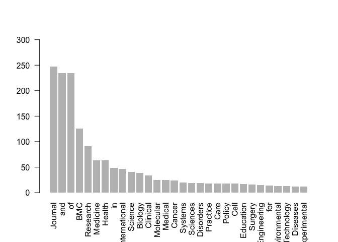

RegExp
================
Rain.Wei
2017/6/18

-   [Set Calculation](#set-calculation)
-   [6.4 Function in stringr](#function-in-stringr)
-   [7 Practical Applications](#practical-applications)
-   [7.1 Reversing a string](#reversing-a-string)
-   [7.2 Matching e-mail addresses](#matching-e-mail-addresses)
-   [7.3 Matching HTML elements](#matching-html-elements)
-   [7.4 Text Analysis of BioMed Central Journals](#text-analysis-of-biomed-central-journals)

``` r
# We can use regexpr() to get the number of times that a searched pattern is found in a character  vector. When there is no match, we get a value -1. 

data("USArrests")

head(USArrests) 
```

    ##            Murder Assault UrbanPop Rape
    ## Alabama      13.2     236       58 21.2
    ## Alaska       10.0     263       48 44.5
    ## Arizona       8.1     294       80 31.0
    ## Arkansas      8.8     190       50 19.5
    ## California    9.0     276       91 40.6
    ## Colorado      7.9     204       78 38.7

``` r
states = rownames(USArrests) 
positions_a = gregexpr(pattern = "a", text = states, ignore.case = TRUE)
# how many a's?
num_a = sapply(positions_a, function(x) ifelse(x[1] > 0, length(x), 0))
num_a
```

    ##  [1] 4 3 2 3 2 1 0 2 1 1 2 1 0 2 1 2 0 2 1 2 2 1 1 0 0 2 2 2 1 0 0 0 2 2 0
    ## [36] 2 0 2 1 2 2 0 1 1 0 1 1 1 0 0

``` r
# load stringr (remember to install it first)
library(stringr)
# total number of a's
str_count(states, "a")
```

    ##  [1] 3 2 1 2 2 1 0 2 1 1 2 1 0 2 1 2 0 2 1 2 2 1 1 0 0 2 2 2 1 0 0 0 2 2 0
    ## [36] 2 0 2 1 2 2 0 1 1 0 1 1 1 0 0

``` r
# vector of vowels
vowels = c("a", "e", "i", "o", "u")
# vector for storing results
num_vowels = vector(mode = "integer", length = 5)
# calculate number of vowels in each name
for (j in seq_along(vowels)) {
    num_aux = str_count(tolower(states), vowels[j])
num_vowels[j] = sum(num_aux)
}
# add vowel names
names(num_vowels) = vowels
# total number of vowels
num_vowels
```

    ##  a  e  i  o  u 
    ## 61 28 44 36  8

``` r
## a e i o u
## 61 28 44 36 8
# sort them in decreasing order
#sort(num_vowels, decreasing = TRUE)
## a i o e u
## 61 44 36 28 8
#And finally, we can visualize the distribution with a barplot:
# barplot
barplot(num_vowels, main = "Number of vowels in USA States names",
border = NA, ylim = c(0, 80))
```



``` r
df2 = data.frame(numbers = 1:5, letters = letters[1:5],
                 stringsAsFactors = FALSE)  
# character would be convert to factor default. 
df2
```

    ##   numbers letters
    ## 1       1       a
    ## 2       2       b
    ## 3       3       c
    ## 4       4       d
    ## 5       5       e

``` r
str(df2)
```

    ## 'data.frame':    5 obs. of  2 variables:
    ##  $ numbers: int  1 2 3 4 5
    ##  $ letters: chr  "a" "b" "c" "d" ...

``` r
# read 'ktop100.txt' file
top105 = readLines("http://www.textfiles.com/music/ktop100.txt") 
head(top105) 
```

    ## [1] "From: ed@wente.llnl.gov (Ed Suranyi)"
    ## [2] "Date: 12 Jan 92 21:23:55 GMT"        
    ## [3] "Newsgroups: rec.music.misc"          
    ## [4] "Subject: KITS' year end countdown"   
    ## [5] ""                                    
    ## [6] ""

``` r
length(top105)
```

    ## [1] 123

``` r
top105[11:15]
```

    ## [1] "1. NIRVANA                      SMELLS LIKE TEEN SPIRIT"
    ## [2] "2. EMF                          UNBELIEVABLE"           
    ## [3] "3. R.E.M.                       LOSING MY RELIGION"     
    ## [4] "4. SIOUXSIE & THE BANSHEES      KISS THEM FOR ME"       
    ## [5] "5. B.A.D. II                    RUSH"

``` r
# One of the potential problems with paste() is that it coerces missing values NA into the
# character "NA":
evalue = paste("the value of 'e' is", exp(1), NA)
evalue
```

    ## [1] "the value of 'e' is 2.71828182845905 NA"

``` r
no_quotes = noquote(c("some", "quoted", "text", "!%^(&="))
# display
no_quotes
```

    ## [1] some   quoted text   !%^(&=

``` r
## [1] some quoted text !%^(&=
# check class
class(no_quotes)
```

    ## [1] "noquote"

``` r
## [1] "noquote"
# test character
is.character(no_quotes)
```

    ## [1] TRUE

``` r
## [1] TRUE
# no quotes even when subscripting
no_quotes[2:3]
```

    ## [1] quoted text

``` r
## [1] quoted text
```

``` r
my_string = 'programming with data is fun'
cat(my_string, "with R\n", sep = " =) ")
```

    ## programming with data is fun =) with R

``` r
## programming with data is fun =) with R 
cat(1:10, sep = "-")
```

    ## 1-2-3-4-5-6-7-8-9-10

``` r
## 1-2-3-4-5-6-7-8-9-10
```

``` r
# The argument fill allows us to break long strings; this is achieved when we specify the
# string width with an integer number:
 # fill = 30
cat("Loooooooooong strings", "can be displayed", "in a nice format",
"by using the 'fill' argument", fill = 30)
```

    ## Loooooooooong strings 
    ## can be displayed 
    ## in a nice format 
    ## by using the 'fill' argument

``` r
# cat with output in a given file
cat(my_string, "with R", file = "output.txt") 
```

``` r
# format makes numbers the samle length. 
format(c(6, 13.1), digits = 2, nsmall = 1) 
```

    ## [1] " 6.0" "13.1"

``` r
format(c(6, 123.12), digits = 2, nsmall = 2, justify = 'none') 
```

    ## [1] "  6.00" "123.12"

``` r
format(123456789, big.mark = ",")
```

    ## [1] "123,456,789"

``` r
# '%f' indicates 'fixed point' decimal notation
sprintf("%f", pi)
```

    ## [1] "3.141593"

``` r
## [1] "3.141593"
# decimal notation with 3 decimal digits
sprintf("%.3f", pi)
```

    ## [1] "3.142"

``` r
## [1] "3.142"
# 1 integer and 0 decimal digits
sprintf("%1.0f", pi)
```

    ## [1] "3"

``` r
## [1] "3"
# decimal notation with 3 decimal digits
sprintf("%5.1f", pi)
```

    ## [1] "  3.1"

``` r
## [1] " 3.1"
sprintf("%05.1f", pi)
```

    ## [1] "003.1"

``` r
## [1] "003.1"
# print with sign (positive)
sprintf("%+f", pi)
```

    ## [1] "+3.141593"

``` r
## [1] "+3.141593"
# prefix a space
sprintf("% f", pi)
```

    ## [1] " 3.141593"

``` r
## [1] " 3.141593" 
sprintf("%   f", pi) # any longer space the same output 
```

    ## [1] " 3.141593"

``` r
# left adjustment
sprintf("%-10f", pi) # left justified
```

    ## [1] "3.141593  "

``` r
## [1] "3.141593 "
# exponential decimal notation 'e'
sprintf("%e", pi)
```

    ## [1] "3.141593e+00"

``` r
## [1] "3.141593e+00"
# exponential decimal notation 'E'
sprintf("%E", pi)
```

    ## [1] "3.141593E+00"

``` r
## [1] "3.141593E+00"
# number of significant digits (6 by default)
sprintf("%g", pi)
```

    ## [1] "3.14159"

``` r
## [1] "3.14159" 

sprintf("%1.0f", pi*10)
```

    ## [1] "31"

``` r
# The function toString() allows us to convert an R object to a character string. This function
# can be used as a helper for format() to produce a single character string from several obejcts
# inside a vector. The result will be a character vector of length 1 with elements separated by
# commas:
# default usage
toString(17.04)
```

    ## [1] "17.04"

``` r
## [1] "17.04"
# combining two objects
toString(c(17.04, 1978))
```

    ## [1] "17.04, 1978"

``` r
## [1] "17.04, 1978"
# combining several objects
toString(c("Bonjour", 123, TRUE, NA, log(exp(1))))
```

    ## [1] "Bonjour, 123, TRUE, NA, 1"

``` r
## [1] "Bonjour, 123, TRUE, NA, 1"
# use of 'width'
toString(c("one", "two", "3333333333"), width = 8)
```

    ## [1] "one,...."

``` r
## [1] "one,...."
```

``` r
# Comparing printing methods 
# printing method
print(1:5)
```

    ## [1] 1 2 3 4 5

``` r
## [1] 1 2 3 4 5
# convert to character
as.character(1:5)
```

    ## [1] "1" "2" "3" "4" "5"

``` r
## [1] "1" "2" "3" "4" "5"
# concatenation
cat(1:5, sep = "-")
```

    ## 1-2-3-4-5

``` r
## 1-2-3-4-5
# default pasting
paste(1:5)
```

    ## [1] "1" "2" "3" "4" "5"

``` r
## [1] "1" "2" "3" "4" "5"
# paste with collapsing
paste(1:5, collapse = "")
```

    ## [1] "12345"

``` r
## [1] "12345"
# convert to a single string
toString(1:5)
```

    ## [1] "1, 2, 3, 4, 5"

``` r
## [1] "1, 2, 3, 4, 5"
# unquoted output
noquote(as.character(1:5)) 
```

    ## [1] 1 2 3 4 5

``` r
## [1] 1 2 3 4 5
```

``` r
# There’s also the function chartr() which stands for character translation. chartr() takes
# three arguments: an old string, a new string, and a character vector x:
# chartr(old, new, x) 
# replace 'a' by 'A'
chartr("a", "A", "This is a boring string")
```

    ## [1] "This is A boring string"

``` r
## [1] "This is A boring string" 


# It is important to note that old and new must have the same number of characters, otherwise
# you will get a nasty error message like this one:
# incorrect use
# chartr("ai", "X", "This is a bad example")
## Error: ’old’ is longer than ’new’

# multiple replacements
crazy = c("Here's to the crazy ones", "The misfits", "The rebels")
chartr("aei", "#!?", crazy)
```

    ## [1] "H!r!'s to th! cr#zy on!s" "Th! m?sf?ts"             
    ## [3] "Th! r!b!ls"

``` r
## [1] "H!r!'s to th! cr#zy on!s" "Th! m?sf?ts"
## [3] "Th! r!b!ls"
```

``` r
# Abbreviate strings with abbreviate()
# Another useful function for basic manipulation of character strings is abbreviate(). Its
# usage has the following structure:
# abbreviate(names.org, minlength = 4, dot = FALSE, strict = FALSE,
# method = c("left.keep", "both.sides"))
# Although there are several arguments, the main parameter is the character vector (names.org)
# which will contain the names that we want to abbreviate: 

# some color names
some_colors = colors()[1:4]
some_colors
```

    ## [1] "white"         "aliceblue"     "antiquewhite"  "antiquewhite1"

``` r
## [1] "white" "aliceblue" "antiquewhite" "antiquewhite1"
# abbreviate (default usage)
colors1 = abbreviate(some_colors)
colors1
```

    ##         white     aliceblue  antiquewhite antiquewhite1 
    ##        "whit"        "alcb"        "antq"        "ant1"

``` r
## white aliceblue antiquewhite antiquewhite1
## "whit" "alcb" "antq" "ant1"
# abbreviate with 'minlength'
colors2 = abbreviate(some_colors, minlength = 5)
colors2
```

    ##         white     aliceblue  antiquewhite antiquewhite1 
    ##       "white"       "alcbl"       "antqw"       "antq1"

``` r
## white aliceblue antiquewhite antiquewhite1
## "white" "alcbl" "antqw" "antq1"
# abbreviate
colors3 = abbreviate(some_colors, minlength = 3, method = "both.sides")
colors3
```

    ##         white     aliceblue  antiquewhite antiquewhite1 
    ##         "wht"         "alc"         "ant"         "an1"

``` r
## white aliceblue antiquewhite antiquewhite1
## "wht" "alc" "ant" "an1"
```

``` r
# substr(x, start, stop)
# x is a character vector, start indicates the first element to be replaced, and stop indicates
# the last element to be replaced:
# extract 'bcd'
substr("abcdef", 2, 4)
```

    ## [1] "bcd"

``` r
## [1] "bcd"
# replace 2nd letter with hash symbol
x = c("may", "the", "force", "be", "with", "you")
substr(x, 2, 2) <- "#"
x
```

    ## [1] "m#y"   "t#e"   "f#rce" "b#"    "w#th"  "y#u"

``` r
## [1] "m#y" "t#e" "f#rce" "b#" "w#th" "y#u"
# replace 2nd and 3rd letters with happy face
y = c("may", "the", "force", "be", "with", "you")
substr(y, 2, 3) <- ":)"
y
```

    ## [1] "m:)"   "t:)"   "f:)ce" "b:"    "w:)h"  "y:)"

``` r
## [1] "m:)" "t:)" "f:)ce" "b:" "w:)h" "y:)"
# replacement with recycling
z = c("may", "the", "force", "be", "with", "you")
substr(z, 2, 3) <- c("#", "@")
z
```

    ## [1] "m#y"   "t@e"   "f#rce" "b@"    "w#th"  "y@u"

``` r
## [1] "m#y" "t@e" "f#rce" "b@" "w#th" "y@u"
```

``` r
# same as 'substr'
substring("ABCDEF", 2, 4)
```

    ## [1] "BCD"

``` r
## [1] "BCD"
substr("ABCDEF", 2, 4)
```

    ## [1] "BCD"

``` r
## [1] "BCD"
# extract each letter
substring("ABCDEF", 1:6, 1:6)
```

    ## [1] "A" "B" "C" "D" "E" "F"

``` r
## [1] "A" "B" "C" "D" "E" "F"  
substring("ABCDEF", 1:6, 1:6) ## ?
```

    ## [1] "A" "B" "C" "D" "E" "F"

``` r
# multiple replacement with recycling
text = c("more", "emotions", "are", "better", "than", "less") 
substring(text, 1:3)
```

    ## [1] "more"    "motions" "e"       "better"  "han"     "ss"

``` r
substring(text, 1:3) <- c(" ", "zzz")
text
```

    ## [1] " ore"     "ezzzions" "ar "      "zzzter"   "t an"     "lezz"

``` r
## [1] " ore" "ezzzions" "ar " "zzzter" "t an" "lezz"  
text1 = c("more", "emotions", "are", "better", "than", "less") 
substring(text1, 1:3) <- c(" ", 'zzz', 'aa') 
## 能替换掉多少个换多少个  
text1
```

    ## [1] " ore"     "ezzzions" "ara"      " etter"   "tzzz"     "leaa"

Set Calculation
---------------

``` r
sort(c(3,1,1,4)) 
```

    ## [1] 1 1 3 4

``` r
# two character vectors
set1 = c("some", "random", "words", "some")
set2 = c("some", "many", "none", "few")
# union of set1 and set2
union(set1, set2)
```

    ## [1] "some"   "random" "words"  "many"   "none"   "few"

``` r
## [1] "some" "random" "words" "many" "none" "few"
```

``` r
# two character vectors
set3 = c("some", "random", "few", "words")
set4 = c("some", "many", "none", "few")
# intersect of set3 and set4
intersect(set3, set4)
```

    ## [1] "some" "few"

``` r
## [1] "some" "few" 

# two character vectors
set5 = c("some", "random", "few", "words")
set6 = c("some", "many", "none", "few")
# difference between set5 and set6 
setdiff(set5, set6)
```

    ## [1] "random" "words"

``` r
## [1] "random" "words" 


# three character vectors
set7 = c("some", "random", "strings")
set8 = c("some", "many", "none", "few")
set9 = c("strings", "random", "some")
# set7 == set8?
setequal(set7, set8)
```

    ## [1] FALSE

``` r
## [1] FALSE
# set7 == set9?
setequal(set7, set9)
```

    ## [1] TRUE

``` r
## [1] TRUE

# to test whether two vectors are exactly equal (element by element!!!).
# set7 identical to set7?
identical(set7, set7)
```

    ## [1] TRUE

``` r
## [1] TRUE
# set7 identical to set9?
identical(set7, set9)
```

    ## [1] FALSE

``` r
## [1] FALSE
```

``` r
# some text
text = c("one word", "a sentence", "you and me", "three two one")
# pattern
pat = "one" 

# handy function to extract matched term
x = regexpr(pat, text) 
x
```

    ## [1]  1 -1 -1 11
    ## attr(,"match.length")
    ## [1]  3 -1 -1  3
    ## attr(,"useBytes")
    ## [1] TRUE

``` r
substring(text, x, x + attr(x, "match.length") - 1)
```

    ## [1] "one" ""    ""    "one"

``` r
## [1] "one" "" "" "one"
# with NA
regexpr(pat, c(text, NA))
```

    ## [1]  1 -1 -1 11 NA
    ## attr(,"match.length")
    ## [1]  3 -1 -1  3 NA
    ## attr(,"useBytes")
    ## [1] TRUE

``` r
## [1] 1 -1 -1 11 NA
## attr(,"match.length")
## [1] 3 -1 -1 3 NA
```

``` r
# string
Rstring = c("The R Foundation",
"for Statistical Computing",
"R is FREE software",
"R is a collaborative project")
# substitute 'R' with 'RR'
sub("R", "RR", Rstring)
```

    ## [1] "The RR Foundation"             "for Statistical Computing"    
    ## [3] "RR is FREE software"           "RR is a collaborative project"

``` r
# string
Rstring = c("The R Foundation",
"for Statistical Computing",
"R is FREE software",
"R is a collaborative project")
# substitute
gsub("R", "RR", Rstring)
```

    ## [1] "The RR Foundation"             "for Statistical Computing"    
    ## [3] "RR is FRREE software"          "RR is a collaborative project"

``` r
# a sentence
sentence = c("R is a collaborative project with many contributors")
# split into words
strsplit(sentence, " ")
```

    ## [[1]]
    ## [1] "R"             "is"            "a"             "collaborative"
    ## [5] "project"       "with"          "many"          "contributors"

``` r
# telephone numbers
tels = c("510-548-2238", "707-231-2440", "650-752-1300")
# split each number into its portions
strsplit(tels, "-")
```

    ## [[1]]
    ## [1] "510"  "548"  "2238"
    ## 
    ## [[2]]
    ## [1] "707"  "231"  "2440"
    ## 
    ## [[3]]
    ## [1] "650"  "752"  "1300"

6.4 Function in stringr
-----------------------

``` r
# some strings
strings = c("12 Jun 2002", " 8 September 2004 ", "22-July-2009 ",
"01 01 2001", "date", "02.06.2000",
"xxx-yyy-zzzz", "$2,600")
# date pattern (month as text)
dates = "([0-9]{1,2})[- .]([a-zA-Z]+)[- .]([0-9]{4})"
# detect dates
str_detect(strings, dates)
```

    ## [1]  TRUE  TRUE  TRUE FALSE FALSE FALSE FALSE FALSE

``` r
# tweets about 'Paris'
paris_tweets = c(
"#Paris is chock-full of cultural and culinary attractions",
"Some time in #Paris along Canal St.-Martin famous by #Amelie",
"While you're in #Paris, stop at cafe: http://goo.gl/yaCbW",
"Paris, the city of light")
# hashtag pattern 
hash = "#[a-zA-Z]{1,}"
# extract (first) hashtag
str_extract(paris_tweets, hash)
```

    ## [1] "#Paris" "#Paris" "#Paris" NA

In addition, those elements that don’t match the pattern are indicated with an empty character vector character(0) instead of NA

``` r
# extract (all) hashtags
str_extract_all(paris_tweets, "#[a-zA-Z]{1,}") 
```

    ## [[1]]
    ## [1] "#Paris"
    ## 
    ## [[2]]
    ## [1] "#Paris"  "#Amelie"
    ## 
    ## [[3]]
    ## [1] "#Paris"
    ## 
    ## [[4]]
    ## character(0)

``` r
# string vector
strings = c("12 Jun 2002", " 8 September 2004 ", "22-July-2009 ",
"01 01 2001", "date", "02.06.2000",
"xxx-yyy-zzzz", "$2,600")
# date pattern (month as text)
dates = "([0-9]{1,2})[- .]([a-zA-Z]+)[- .]([0-9]{4})"
# extract first matched group
str_match(strings, dates)
```

    ##      [,1]               [,2] [,3]        [,4]  
    ## [1,] "12 Jun 2002"      "12" "Jun"       "2002"
    ## [2,] "8 September 2004" "8"  "September" "2004"
    ## [3,] "22-July-2009"     "22" "July"      "2009"
    ## [4,] NA                 NA   NA          NA    
    ## [5,] NA                 NA   NA          NA    
    ## [6,] NA                 NA   NA          NA    
    ## [7,] NA                 NA   NA          NA    
    ## [8,] NA                 NA   NA          NA

``` r
# tweets about 'Paris'
paris_tweets = c(
"#Paris is chock-full of cultural and culinary attractions",
"Some time in #Paris along Canal St.-Martin famous by #Amelie",
"While you're in #Paris, stop at cafe: http://goo.gl/yaCbW",
"Paris, the city of light")
# match (all) hashtags in 'paris_tweets'
str_match_all(paris_tweets, "#[a-zA-Z]{1,}")
```

    ## [[1]]
    ##      [,1]    
    ## [1,] "#Paris"
    ## 
    ## [[2]]
    ##      [,1]     
    ## [1,] "#Paris" 
    ## [2,] "#Amelie"
    ## 
    ## [[3]]
    ##      [,1]    
    ## [1,] "#Paris"
    ## 
    ## [[4]]
    ##      [,1]

Those elements that don’t match the pattern are indicated with an empty character vector instead of an NA.

``` r
# locate position of (first) hashtag
str_locate(paris_tweets, "#[a-zA-Z]{1,}")
```

    ##      start end
    ## [1,]     1   6
    ## [2,]    14  19
    ## [3,]    17  22
    ## [4,]    NA  NA

``` r
# locate (all) hashtags in 'paris_tweets'
str_locate_all(paris_tweets, "#[a-zA-Z]{1,}")
```

    ## [[1]]
    ##      start end
    ## [1,]     1   6
    ## 
    ## [[2]]
    ##      start end
    ## [1,]    14  19
    ## [2,]    54  60
    ## 
    ## [[3]]
    ##      start end
    ## [1,]    17  22
    ## 
    ## [[4]]
    ##      start end

``` r
# city names
cities = c("San Francisco", "Barcelona", "Naples", "Paris")
# replace first matched vowel
str_replace(cities, "[aeiou]", ";")
```

    ## [1] "S;n Francisco" "B;rcelona"     "N;ples"        "P;ris"

``` r
## [1] "S;n Francisco" "B;rcelona" "N;ples" "P;ris"
```

``` r
# replace first matched consonant
str_replace(cities, "[^aeiou]", ";")
```

    ## [1] ";an Francisco" ";arcelona"     ";aples"        ";aris"

``` r
## [1] ";an Francisco" ";arcelona" ";aples" ";aris"
```

``` r
# city names
cities = c("San Francisco", "Barcelona", "Naples", "Paris")
# replace all matched vowel
str_replace_all(cities, pattern = "[aeiou]", ";")
```

    ## [1] "S;n Fr;nc;sc;" "B;rc;l;n;"     "N;pl;s"        "P;r;s"

``` r
## [1] "S;n Fr;nc;sc;" "B;rc;l;n;" "N;pl;s" "P;r;s"
```

``` r
# replace all matched consonants
str_replace_all(cities, pattern = "[^aeiou]", ";")
```

    ## [1] ";a;;;;a;;i;;o" ";a;;e;o;a"     ";a;;e;"        ";a;i;"

``` r
## [1] ";a;;;;a;;i;;o" ";a;;e;o;a" ";a;;e;" ";a;i;"
```

``` r
# a sentence
sentence = c("R is a collaborative project with many contributors")
# split into words
str_split(sentence, " ")
```

    ## [[1]]
    ## [1] "R"             "is"            "a"             "collaborative"
    ## [5] "project"       "with"          "many"          "contributors"

``` r
# telephone numbers
tels = c("510-548-2238", "707-231-2440", "650-752-1300")
# split each number into its portions
str_split(tels, "-")
```

    ## [[1]]
    ## [1] "510"  "548"  "2238"
    ## 
    ## [[2]]
    ## [1] "707"  "231"  "2440"
    ## 
    ## [[3]]
    ## [1] "650"  "752"  "1300"

``` r
# string
flavors = c("chocolate", "vanilla", "cinnamon", "mint", "lemon")
# split by vowels
str_split(flavors, "[aeiou]")
```

    ## [[1]]
    ## [1] "ch" "c"  "l"  "t"  ""  
    ## 
    ## [[2]]
    ## [1] "v"  "n"  "ll" ""  
    ## 
    ## [[3]]
    ## [1] "c"  "nn" "m"  "n" 
    ## 
    ## [[4]]
    ## [1] "m"  "nt"
    ## 
    ## [[5]]
    ## [1] "l" "m" "n"

``` r
# split by first vowel
str_split(flavors, "[aeiou]", n = 2)
```

    ## [[1]]
    ## [1] "ch"     "colate"
    ## 
    ## [[2]]
    ## [1] "v"     "nilla"
    ## 
    ## [[3]]
    ## [1] "c"      "nnamon"
    ## 
    ## [[4]]
    ## [1] "m"  "nt"
    ## 
    ## [[5]]
    ## [1] "l"   "mon"

7 Practical Applications
------------------------

1.  reversing a string
2.  matching email addresses
3.  matching html elements (href’s and img’s anchors)
4.  some stats and analytics of character data

7.1 Reversing a string
----------------------

``` r
# function that reverses a string by characters
reverse_chars <- function(string)
{
# split string by characters
string_split = strsplit(string, split = "")
# reverse order
rev_order = nchar(string):1
# reversed characters
reversed_chars = string_split[[1]][rev_order]
# collapse reversed characters
paste(reversed_chars, collapse="")
}

# try 'reverse_chars'
reverse_chars("abcdefg")
```

    ## [1] "gfedcba"

``` r
## [1] "gfedcba"
# try with non-character input
# reverse_chars(12345)
```

``` r
# reversing a string by characters
reverse_chars <- function(string)
{
string_split = strsplit(as.character(string), split = "")
reversed_split = string_split[[1]][nchar(string):1]
paste(reversed_split, collapse="")
} 

# example with one word
reverse_chars("atmosphere")
```

    ## [1] "erehpsomta"

``` r
## [1] "erehpsomta"
# example with a several words
reverse_chars("the big bang theory")
```

    ## [1] "yroeht gnab gib eht"

``` r
## [1] "yroeht gnab gib eht"
```

``` r
# try 'reverse_chars'
reverse_chars("abcdefg")
```

    ## [1] "gfedcba"

``` r
## [1] "gfedcba"
# try with non-character input
reverse_chars(12345)
```

    ## [1] "54321"

``` r
## [1] "54321"
```

``` r
# reverse vector (by characters)
lapply(c("the big bang theory", "atmosphere"), reverse_chars)
```

    ## [[1]]
    ## [1] "yroeht gnab gib eht"
    ## 
    ## [[2]]
    ## [1] "erehpsomta"

``` r
# function that reverses a string by words
reverse_words <- function(string)
{
# split string by blank spaces
string_split = strsplit(as.character(string), split = " ")
# how many split terms?
string_length = length(string_split[[1]])
# decide what to do
if (string_length == 1) {
# one word (do nothing)
reversed_string = string_split[[1]]
} else {
# more than one word (collapse them)
reversed_split = string_split[[1]][string_length:1]
reversed_string = paste(reversed_split, collapse = " ")
}
# output
return(reversed_string)
}
# examples
reverse_words("atmosphere")
```

    ## [1] "atmosphere"

``` r
## [1] "atmosphere"
reverse_words("the big bang theory")
```

    ## [1] "theory bang big the"

``` r
## [1] "theory bang big the"
```

``` r
# reverse vector (by words)
lapply(c("the big bang theory", "atmosphere"), reverse_words)
```

    ## [[1]]
    ## [1] "theory bang big the"
    ## 
    ## [[2]]
    ## [1] "atmosphere"

7.2 Matching e-mail addresses
-----------------------------

``` r
# pattern
email_pat = "^([a-z0-9_\\.-]+)@([\\da-z\\.-]+)\\.([a-z\\.]{2,6})$"
# string that matches
grepl(pattern = email_pat, x = "gaston@abc.com")
```

    ## [1] TRUE

``` r
# another string that matches
grep(pattern = email_pat, x = "gaston.sanchez@research-center.fr")
```

    ## [1] 1

``` r
# unmatched email (TLD too long)
grep(pattern = email_pat, x = "gaston@abc.something") 
```

    ## integer(0)

``` r
# potential email addresses
emails = c(
"simple@example.com",
"johnsmith@email.gov",
"marie.curie@college.edu",
"very.common@example.com",
"a.little.lengthy.but.ok@dept.example.com",
"disposable.style.email.with+symbol@example.com",
"not_good@email.address")
# detect pattern
str_detect(string=emails, pattern=email_pat)
```

    ## [1]  TRUE  TRUE  TRUE  TRUE  TRUE FALSE FALSE

7.3 Matching HTML elements
--------------------------

``` r
# read html content
mail_lists = readLines("https://www.r-project.org/mail.html") 
```

``` r
# SIG's href pattern
sig_pattern = '^.*<p> *<a href="(https.*)">.*$'
# find SIG href attributes
sig_hrefs = grep(sig_pattern, mail_lists, value = TRUE)
# let's see first 5 elements (shorten output)
shorten_sigs = rep("", 5)
for (i in 1:5) {
shorten_sigs[i] = toString(sig_hrefs[i], width=70)
}
shorten_sigs
```

    ## [1] "<li><p><a href=\"https://stat.ethz.ch/mailman/listinfo/r-sig-mac\"><...."
    ## [2] "<li><p><a href=\"https://stat.ethz.ch/mailman/listinfo/r-sig-db\"><c...."
    ## [3] "<li><p><a href=\"https://stat.ethz.ch/mailman/listinfo/r-sig-debian...." 
    ## [4] "<li><p><a href=\"https://stat.ethz.ch/mailman/listinfo/r-sig-dynami...." 
    ## [5] "<li><p><a href=\"https://stat.ethz.ch/mailman/listinfo/r-sig-ecolog...."

``` r
# get first matched group
sub(sig_pattern, "\\1", sig_hrefs)
```

    ##  [1] "https://stat.ethz.ch/mailman/listinfo/r-sig-mac"           
    ##  [2] "https://stat.ethz.ch/mailman/listinfo/r-sig-db"            
    ##  [3] "https://stat.ethz.ch/mailman/listinfo/r-sig-debian"        
    ##  [4] "https://stat.ethz.ch/mailman/listinfo/r-sig-dynamic-models"
    ##  [5] "https://stat.ethz.ch/mailman/listinfo/r-sig-ecology"       
    ##  [6] "https://stat.ethz.ch/mailman/listinfo/r-sig-epi"           
    ##  [7] "https://stat.ethz.ch/mailman/listinfo/r-sig-fedora"        
    ##  [8] "https://stat.ethz.ch/mailman/listinfo/r-sig-finance"       
    ##  [9] "https://stat.ethz.ch/mailman/listinfo/r-sig-geo"           
    ## [10] "https://stat.ethz.ch/mailman/listinfo/r-sig-gr"            
    ## [11] "https://stat.ethz.ch/mailman/listinfo/r-sig-gui"           
    ## [12] "https://stat.ethz.ch/mailman/listinfo/r-sig-hpc"           
    ## [13] "https://stat.ethz.ch/mailman/listinfo/r-sig-insurance"     
    ## [14] "https://stat.ethz.ch/mailman/listinfo/r-sig-jobs"          
    ## [15] "https://stat.ethz.ch/mailman/listinfo/r-sig-mediawiki"     
    ## [16] "https://stat.ethz.ch/mailman/listinfo/r-sig-mixed-models"  
    ## [17] "https://stat.ethz.ch/mailman/listinfo/r-sig-networks"      
    ## [18] "https://stat.ethz.ch/mailman/listinfo/r-sig-phylo"         
    ## [19] "https://stat.ethz.ch/mailman/listinfo/r-sig-qa"            
    ## [20] "https://stat.ethz.ch/mailman/listinfo/r-sig-robust"        
    ## [21] "https://stat.ethz.ch/mailman/listinfo/r-sig-teaching"

As you can see, we are using the regex pattern \\\\1 in the sub() function. Generally speaking \\\\N is replaced with the N-th group specified in the regular expression. The first matched group is referenced by \\\\1. In our example, the first group is everything that is contained in the curved brackets, that is: (https.\*), which are in fact the links we are looking for.

7.4 Text Analysis of BioMed Central Journals
--------------------------------------------

``` r
# link of data set
url = "https://www.biomedcentral.com/info/journals/biomedcentraljournallist.txt"
# read data (stringsAsFactors=FALSE)
biomed = read.table(url, header = TRUE, sep = ",", stringsAsFactors = FALSE)
```

``` r
# structure of the dataset
str(biomed, vec.len = 1)
```

    ## 'data.frame':    902 obs. of  7 variables:
    ##  $ Publisher     : chr  "Springer" ...
    ##  $ Journal.name  : chr  "3 Biotech" ...
    ##  $ Abbreviation  : chr  "3 Biotech" ...
    ##  $ ISSN          : chr  "2190-5738" ...
    ##  $ URL           : chr  "http://www.springer.com/13205" ...
    ##  $ Start.Date    : int  2011 2015 ...
    ##  $ Citation.Style: chr  "n/a" ...

``` r
# first 5 journal names
head(biomed$Journal.name, 5)
```

    ## [1] "3 Biotech"                 "3D Printing in Medicine"  
    ## [3] "AAPS Open"                 "AIDS Research and Therapy"
    ## [5] "AIDS Research and Therapy"

``` r
# get first 10 names
titles10 = biomed$Journal.name[1:10]
titles10
```

    ##  [1] "3 Biotech"                            
    ##  [2] "3D Printing in Medicine"              
    ##  [3] "AAPS Open"                            
    ##  [4] "AIDS Research and Therapy"            
    ##  [5] "AIDS Research and Therapy"            
    ##  [6] "AMB Express"                          
    ##  [7] "Acta Neuropathologica Communications" 
    ##  [8] "Acta Veterinaria Scandinavica"        
    ##  [9] "Acta Veterinaria Scandinavica"        
    ## [10] "Addiction Science & Clinical Practice"

``` r
# remove punctuation
titles10 = str_replace_all(titles10, pattern = "[[:punct:]]", "")
titles10
```

    ##  [1] "3 Biotech"                           
    ##  [2] "3D Printing in Medicine"             
    ##  [3] "AAPS Open"                           
    ##  [4] "AIDS Research and Therapy"           
    ##  [5] "AIDS Research and Therapy"           
    ##  [6] "AMB Express"                         
    ##  [7] "Acta Neuropathologica Communications"
    ##  [8] "Acta Veterinaria Scandinavica"       
    ##  [9] "Acta Veterinaria Scandinavica"       
    ## [10] "Addiction Science  Clinical Practice"

``` r
# trim extra whitespaces
titles10 = str_replace_all(titles10, pattern = "\\s+", " ")
titles10
```

    ##  [1] "3 Biotech"                           
    ##  [2] "3D Printing in Medicine"             
    ##  [3] "AAPS Open"                           
    ##  [4] "AIDS Research and Therapy"           
    ##  [5] "AIDS Research and Therapy"           
    ##  [6] "AMB Express"                         
    ##  [7] "Acta Neuropathologica Communications"
    ##  [8] "Acta Veterinaria Scandinavica"       
    ##  [9] "Acta Veterinaria Scandinavica"       
    ## [10] "Addiction Science Clinical Practice"

``` r
# remove punctuation symbols
all_titles = str_replace_all(biomed$Journal.name, pattern = "[[:punct:]]", "") 
# trim extra whitespaces
all_titles = str_replace_all(all_titles, pattern = "\\s+", " ") 
# split titles by words
all_titles_list = str_split(all_titles, pattern = " ")
# show first 2 elements
all_titles_list[1:2]
```

    ## [[1]]
    ## [1] "3"       "Biotech"
    ## 
    ## [[2]]
    ## [1] "3D"       "Printing" "in"       "Medicine"

``` r
# how many words per title
words_per_title = sapply(all_titles_list, length)
# table of frequencies
table(words_per_title)
```

    ## words_per_title
    ##   1   2   3   4   5   6   7   8   9 
    ##  30 250 201 169 113  85  32  19   3

``` r
# distribution
100 * round(table(words_per_title)/length(words_per_title), 4) 
```

    ## words_per_title
    ##     1     2     3     4     5     6     7     8     9 
    ##  3.33 27.72 22.28 18.74 12.53  9.42  3.55  2.11  0.33

``` r
# summary
summary(words_per_title)
```

    ##    Min. 1st Qu.  Median    Mean 3rd Qu.    Max. 
    ##   1.000   2.000   3.000   3.644   5.000   9.000

``` r
# longest journal
all_titles[which(words_per_title == 9)]
```

    ## [1] "International Journal Of Recycling of Organic Waste in Agriculture"
    ## [2] "Journal of Venomous Animals and Toxins including Tropical Diseases"
    ## [3] "Journal of Venomous Animals and Toxins including Tropical Diseases"

``` r
# vector of words in titles
title_words = unlist(all_titles_list)
# get unique words
unique_words = unique(title_words)
# how many unique words in total
num_unique_words = length(unique(title_words))
num_unique_words
```

    ## [1] 772

``` r
# vector to store counts
count_words = rep(0, num_unique_words)
# count number of occurrences
for (i in 1:num_unique_words) {
    count_words[i] = sum(title_words == unique_words[i])
}
count_words_alt = table(title_words) 
table(count_words)
```

    ## count_words
    ##   1   2   3   4   5   6   7   8   9  10  11  12  13  14  15  16  17  18 
    ## 293 270  56  42  32  18   9   6   8   5   3   2   2   1   1   1   1   4 
    ##  19  20  24  25  34  39  41  47  49  63  91 126 234 247 
    ##   2   1   1   2   1   1   1   1   1   2   1   1   2   1

``` r
# equivalently
table(count_words_alt)
```

    ## count_words_alt
    ##   1   2   3   4   5   6   7   8   9  10  11  12  13  14  15  16  17  18 
    ## 293 270  56  42  32  18   9   6   8   5   3   2   2   1   1   1   1   4 
    ##  19  20  24  25  34  39  41  47  49  63  91 126 234 247 
    ##   2   1   1   2   1   1   1   1   1   2   1   1   2   1

``` r
# index values in decreasing order
top_30_order = order(count_words, decreasing = TRUE)[1:30]
# top 30 frequencies
top_30_freqs = sort(count_words, decreasing = TRUE)[1:30]
# select top 30 words
top_30_words = unique_words[top_30_order]
top_30_words
```

    ##  [1] "Journal"       "and"           "of"            "BMC"          
    ##  [5] "Research"      "Medicine"      "Health"        "in"           
    ##  [9] "International" "Science"       "Biology"       "Clinical"     
    ## [13] "Molecular"     "Medical"       "Cancer"        "Systems"      
    ## [17] "Sciences"      "Disorders"     "Practice"      "Care"         
    ## [21] "Policy"        "Cell"          "Education"     "Surgery"      
    ## [25] "Engineering"   "for"           "Environmental" "Technology"   
    ## [29] "Diseases"      "Experimental"

``` r
# barplot
barplot(top_30_freqs, border = NA, names.arg = top_30_words,
las = 2, ylim = c(0, 100 * ceiling(max(count_words_alt)/100)))
```



``` r
expt1 <- try(library(wordcloud), silent = T) 
```

    ## Loading required package: RColorBrewer

``` r
if(length(expt1) == 1){
    if(attr(expt1, 'condition')$message == "there is no package called ‘wordcloud’"){
    install.packages('wordcloud', quiet = T) 
    } 
}
library(wordcloud)  
# wordcloud
wordcloud(unique_words, count_words, scale=c(7.5,.5), min.freq=6, 
          max.words=Inf, random.order=FALSE, rot.per=.10, random.color = T, 
          colors = rainbow(20))
```


